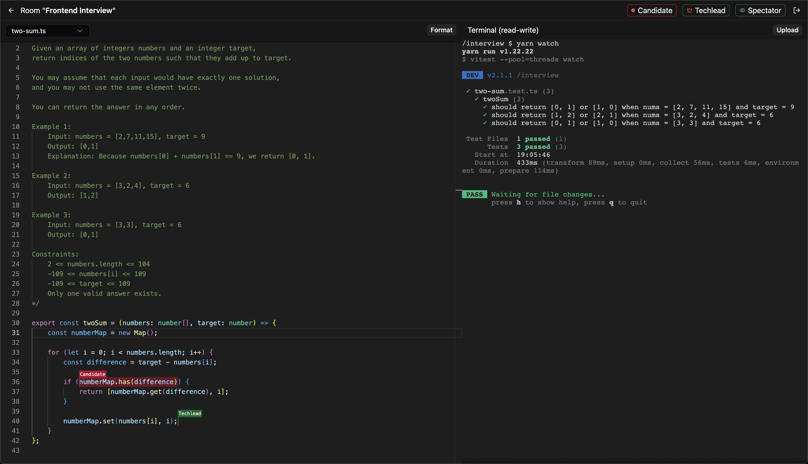

# Interview platform

A self-hostable platform for conducting technical interviews




## Table of contents
- [Interview platform](#interview-platform)
  - [Table of contents](#table-of-contents)
  - [Usage](#usage)
    - [Production](#production)
    - [Local](#local)
  - [Development](#development)
    - [Web](#web)
    - [Backend](#backend)
    - [Insider](#insider)
  - [Security](#security)
  - [Scalability](#scalability)


## Usage

Generate JWT keys
```bash
./tools/generate-jwt-keys.sh
```

Generate a `.env` file
```bash
./tools/generate-env.sh
```

### Production

Pull all room images
```bash
docker-compose -f ./compose.insiders.yml pull
```

Pull and start the application
```bash
docker-compose up --pull -d
```


### Local

Build all room images
```bash
docker-compose -f ./compose.insiders.yml build
```

Build and start the application
```bash
docker-compose up --build
```


## Development

Generate JWT keys
```bash
./tools/generate-jwt-keys.sh
```


### Web

1. Go to the `web` directory
    ```bash
    cd web
    ```
2. Install dependecies
    ```bash
    npm install
    ```
3. Start dev server
    ```bash
    npm run dev
    ```

> [!NOTE]
> While in local development mode you can only connect to one instance of `insider`


### Backend

1. Go to the `backend` directory
    ```bash
    cd backend
    ```
2. Install dependecies
    ```bash
    npm install
    ```
3. Launch docker daemon
4. Create a Postgres DB
5. Create a `.env` file like this
    ```bash
    NODE_ENV='development'
    DATABASE_URL='postgres://<postgres user>:<postgres password>@<postgres host>:<postgres port>/<postgres db name>'
    DOCKER_SOCKET_PATH='<path to your docker socket, ususally: /var/run/docker.sock>'
    HASHING_SECRET_HEX='<output of openssl rand -hex 32>'
    REGISTRATION_OPEN='true'
    ```
6. Run DB migration
    ```bash
    npm run drizzle-migrate
    ```
7. Start dev server
    ```bash
    npm run dev
    ```

> [!TIP]
> You can prototype DB changes using
> ```bash
> npm run drizzle-push
> ```

> [!IMPORTANT]
> Before committing, run
> ```bash
> npm run drizzle-generate
> ```
> To save your changes as a DB migration file


### Insider

1. Go to the `insider` directory
    ```bash
    cd insider
    ```
2. Install dependecies
    ```bash
    npm install
    ```
3. Start dev server
    ```bash
    npm run dev
    ```


## Security

Currently we expose the host's docker socket to the backend container and to the [traefik](https://traefik.io/traefik/) container. This means that if the backend container is compromised, the attacker will effectively have root access to the host machine \
[Why this is dangerous](https://www.lvh.io/posts/dont-expose-the-docker-socket-not-even-to-a-container/) \
[Traefik docs on this matter](https://doc.traefik.io/traefik/providers/docker/#docker-api-access)

For this reason
> [!CAUTION]
> **For production use this inside a virtual machine or on an isolated server**

In future there is a plan to move to resolve this issue, but additional research is needed.


## Scalability

Currently horizontal scaling is not supported.
This should not be a problem for most users, who want to use the system for technical interviews in their company

However horizontal scaling through kubernetes might be supported in the future
